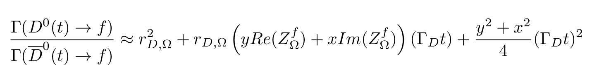
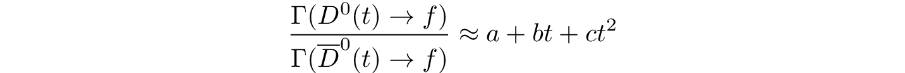

Charm Fitter
============
Library of stuff for fitting ratio of D->K3pi decay times to stuff that looks like (a + bt + ct2) or something

Theory
------
There is some theory behind why we expect:

Parametrisations
----------------
We can fit to this equation by parametrising it as:

and fitting to *a*, *b* and *c*; or we can just fit to all the parameters as it is.

If we fit to this equation as-is we don't have enough information to find all the parameters.
We can get *x* and *y* from external input and we can hold one of the components of *Z* constant as we fit.
We can also hold both of them constant and scan over the allowed values in to see the Chisq landscape of *Z*.

We can then combine this with the constraint on Z from CLEO to get a nice constraint on *Z*.

Fitters
-------
 - Fit to the parameters in the first equation
 - Fit to the parameters in the first equation, including CLEO constraints

Each fitter is currently a chi squared fitter that calculates the ratio of DCS/CF events it expects in each bin
given the current parameters, optimising the chi squared distance between expected and actual ratios in each bin
