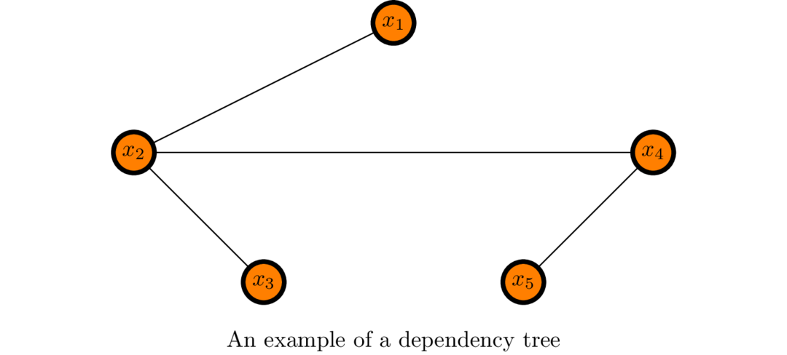
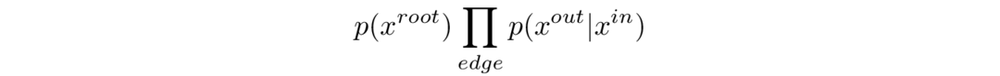
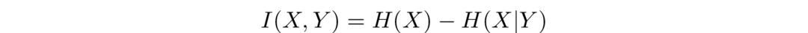
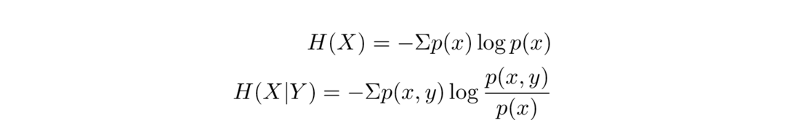
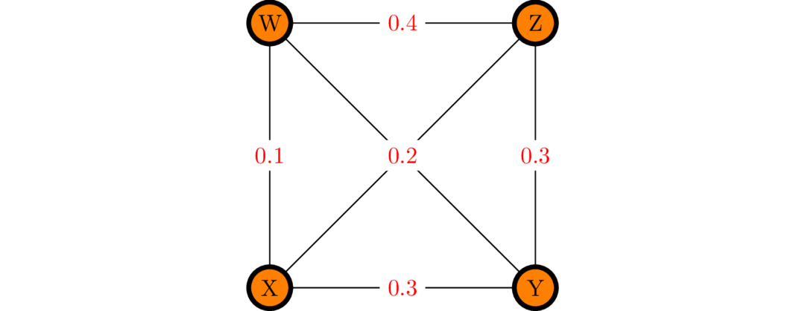
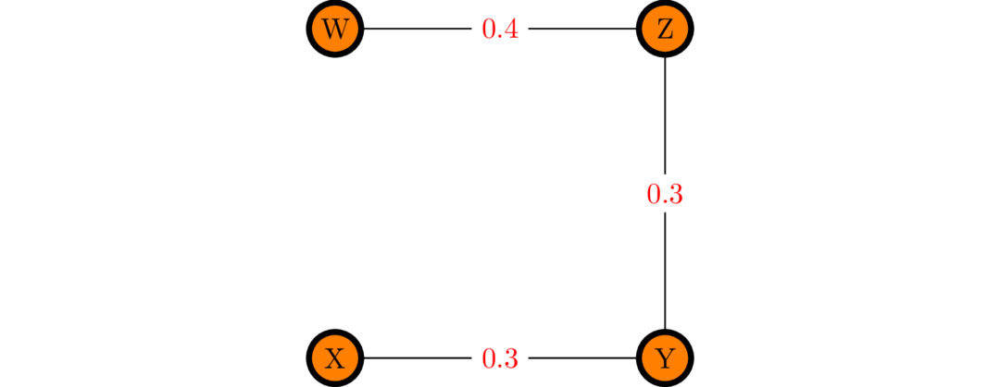
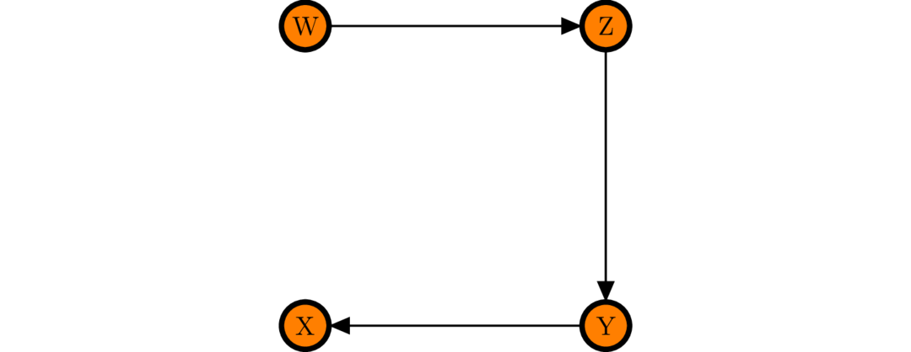
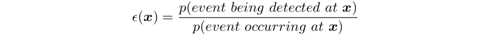

Chow-Liu Efficiency
====

Based on [this paper](https://ieeexplore.ieee.org/document/1054142/) (Chow & Liu, 1968), 
we can approximate a joint probability distribution
p(a, b, c, d, e ...) using a second order expansion, e.g. p(a)p(b|a)p(c|b)...

Chow & Liu described a method to find the second order expansion that
best approximates the original joint distribution.
This page describes how this can be used to approximate the detector efficiency for this analysis.

Making the Optimal Approximation
----
The dependence relations between variables used in our approximation
can be represented as a dependency tree (in the graph-theoretic sense). 
For example:

This tree tells us that our approximation should use the pairs of variables (x1, x2), (x2, x3), (x2, x4) and (x4, x5).

Chow & Liu showed that the best possible approximation to p(a, b, c, d, 
e...) using second order dependences between variables can be found
using the following algorithm:

1. Calculate the [mutual information](#mutual-information) between every pair of variables
2. Draw a complete graph for representing your variables, connecting every pair of variables with an edge whose weight is their mutual information.
3. Find the maximum spanning tree of this graph
4. Choose a node to act as your "root" and draw arrows on each edge directed towards it
5. The approximation is given by:

Where the product is taken over all edges in the graph.

### [Mutual Information](#mutual-information)

Mutual Information (MI) is a measure of the dependence between two variables.
Specifically, it tells us the amount in information (in some units)
that measuring one random variable tells us about another.
In our case, we want to make a good approximation to a joint probability distribution using 2nd order distributions.
This means we want to keep as much information as possible about
the correlations between variables, so we want to keep the pairs
which share the highest mutual information.

Mathematically, mutual information is defined as:

The entropy *H* will be familiar from statistical mechanics...

Note that these definitions imply symmetry; I(X, Y) = I(Y, X).

Example
----
For example, we may have a 4d probability distribution p(W, X, Y, Z) with the following mutual information between pairs:

|  MI   | W | X   | Y   | Z  |
| ----- | - |  -  | -   |  - |
| **W** | - | 0.1 | 0.2 | 0.4|
| **X** | - |  -  | 0.3 | 0.2|
| **Y** | - |  -  | -   | 0.3|
| **Z** | - |  -  | -   |  - |

This would be represented by the following complete graph:

In this case, the two edges W->Y and Z->X have the same weight of 0.2.

The maximum spanning tree (found using e.g. Kruskal's algorithm) would then be:

We are free to choose any node as our root; for concreteness let's
choose X, and then draw arrowheads on each edge pointing towards it.
There's only one way to do this since the graph is a tree.

I've removed the labels since the edge weights are now moot.

Using the formula above, we can now write our approximation as:

Application to Efficiency
----

We can write the efficiency as:

I.e. for a given position in phase space, we find the probability of an event occuring there
and the probability of it being detected there.
We can use the Chow-Liu approximation to find estimates of these probability
distributions, treating our phase space dimensions like random variables (this is probably ok...).

It remains to be seen if making two approximations introduces too much uncertainty to be useful..

It would also be nice to have an estimate of the error in our efficiency but I haven't quite worked out how to do that yet
